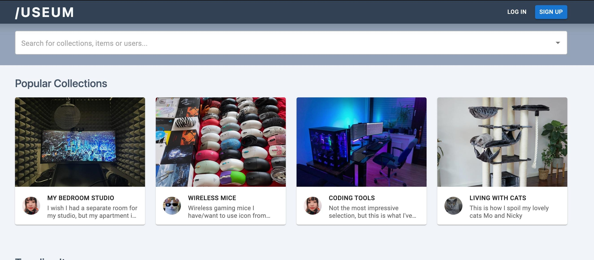

<p align="center">

        
        
        
        
        
        
        
        
        
        

</p>
</br>

<p align="center">

</p>

<h1 align="center">/USEUM - showcase yourself!</h1>

<p align="center">Repo for the frontend code of the Ironhack Bootcamp M3 Project</p>
<p align="center">To see the backend code, please click <b><a href="https://github.com/nncht/association_server">here</a></b></p>

</br>

<div align="center" style="font-size: 16px">
  Think of all the /uses pages that are sitting around the web, waiting to be viewed and compared by web devs all over the world.

Now imagine these <b>/uses</b> encompassing ANYTHING you could imagine - not just software and keyboards, but hiking gear and beer glasses, trading cards and Harry Potter memorabilia.

And NOW imagine a social media platform where you can share all of your collections with others.

</div>

  <p align="center" style="font-size: 18px">Welcome to the /USEUM - <b>please enter <a href="https://useum.netlify.app/" target="_blank">here</a></b></p>

---

</br>

### Installation

<details>
  <summary>For a local installation, follow these steps</summary>

Always run

```bash
npm install
```

before

```bash
npm run dev
```

to make sure everything is there

</details>

</br>

## Project Description

</br>

### Basic Functionalities (Minimum Viable Product)

</br>

- User creation & authentication, login via email & username, account deletion
- Creation / deletion of collections and items (for properties refer to Models)
- Browsing other users collections and items, adding them to own collections
- Image Upload for Users, Collections & Items

</br>

### Advanced Functionalities

</br>

- Bookmarking & "Like"-ing of collections and items
- "Follow"-ing other users
- "Popular Collections / Trending Items" - algorithm based on likes for items & collections
- "Recommended Collections / Items" - algorithm based on congruency of collections / items with users' interests
- AI-generated item & collection descriptions using OpenAI
- Comment section on Collections & Items
- Event Log for every user

</br>

## Technologies

As a MERN stack app, the frontend is written in React with the backend in Node.js and Express connecting to a MongoDB database

Most important technologies include:

- [vite](https://www.npmjs.com/package/vite)
  - Frondent build tool using ESbuild
- [bcryptjs](https://www.npmjs.com/package/bcryptjs)
  - hashing passwords
- [axios](https://www.npmjs.com/package/axios)
  - HTTP client based on Promises
- [React Router](https://www.npmjs.com/package/react-router)
  - Providing core functionality for React Router
- [MUI](https://www.npmjs.com/package/@mui/material)
  - React UI component library
- [TailwindCSS](https://www.npmjs.com/package/tailwindcss)
  - CSS framework for custom UI building
- [PostCSS](https://www.npmjs.com/package/postcss)
  - Transforming styles with JS plugins
- [OpenAI](https://www.npmjs.com/package/openai)
  - Accessing OpenAI API from Node
- [cloudinary](https://www.npmjs.com/package/cloudinary)
  - Image upload using Cloudinary Node SDK
- [jsonwebtoken](https://www.npmjs.com/package/jsonwebtoken)

  </br>

## Project Structure

Overall, the project is split into two repositories - one for handling the frontend, one for the backend. For deployment, we hosted this frontend repo on Netlify, while the backend code is handled by Cylic.

</br>

### Models

</br>

<details>
  <summary>User </summary>

```javascript
const { Schema, model } = require("mongoose");
const Category = require("./Category.model");
const Collection = require("./Collection.model");
const Item = require("./Item.model");
const Comment = require("./Comment.model");

const userSchema = new Schema(
  {
    email: {
      type: String,
      required: [true, "Email is required."],
      unique: true,
      lowercase: true,
      trim: true,
    },
    password: {
      type: String,
      required: [true, "Password is required."],
    },
    username: {
      type: String,
      required: [true, "Username is required."],
      unique: true,
      trim: true,
    },

    userbio: {
      type: String,
      maxlength: 2000,
    },

    pronouns: {
      type: String,
    },

    imageUrl: {
      type: String,
      default: "/images/default/default-profile.png",
    },

    headerImageUrl: {
      type: String,
      default: "/images/default/default-header.svg",
    },

    collections: [
      {
        type: Schema.Types.ObjectId,
        ref: "Collection",
      },
    ],
    items: [
      {
        type: Schema.Types.ObjectId,
        ref: "Item",
      },
    ],
    bookmarks: [
      {
        type: Schema.Types.ObjectId,
        ref: "Item",
      },
      {
        type: Schema.Types.ObjectId,
        ref: "Collection",
      },
    ],
    likes: [
      {
        type: Schema.Types.ObjectId,
        ref: "Item",
      },
      {
        type: Schema.Types.ObjectId,
        ref: "Collection",
      },
    ],
    categories: [
      {
        type: Schema.Types.ObjectId,
        ref: "Category",
      },
    ],
    followers: [
      {
        type: Schema.Types.ObjectId,
        ref: "User",
      },
    ],
    following: [
      {
        type: Schema.Types.ObjectId,
        ref: "User",
      },
    ],
    comments: [
      {
        type: Schema.Types.ObjectId,
        ref: "Comment",
      },
    ],
  },
  {
    // this second object adds extra properties: `createdAt` and `updatedAt`
    timestamps: true,
  }
);

const User = model("User", userSchema);

module.exports = User;
```

</details>

<details>
  <summary>Category </summary>

```javascript
const mongoose = require("mongoose");

const categorySchema = new mongoose.Schema({
  category: {
    type: String,
  },
});

const Category = mongoose.model("Category", categorySchema);

module.exports = Category;
```

</details>

<details>
  <summary>Comment </summary>

```javascript
const { Schema, model } = require("mongoose");

const CommentSchema = new Schema(
  {
    title: {
      type: String,
      // required: [true, 'Title is required.'],
      unique: false,
    },
    body: {
      type: String,
    },
    user: {
      type: Schema.Types.ObjectId,
      ref: "User",
    },
    item: {
      type: Schema.Types.ObjectId,
      ref: "Item",
    },
  },
  {
    timestamps: true,
  }
);

const Comment = model("Comment", CommentSchema);

module.exports = Comment;
```

</details>

<details>
  <summary>Collection </summary>

```javascript
const { Schema, model } = require("mongoose");

const User = require("./User.model");
const Item = require("./Item.model");
const Comment = require("./Comment.model");
const Category = require("./Category.model");

const collectionSchema = new Schema(
  {
    name: {
      type: String,
      required: [true, "Name is required."],
      unique: true,
    },
    description: {
      type: String,
    },

    imageUrl: {
      type: String,
      default: "/images/default/default-collection.svg",
    },
    createdBy: {
      type: Schema.Types.ObjectId,
      ref: "User",
    },

    items: [
      {
        type: Schema.Types.ObjectId,
        ref: "Item",
      },
    ],
    comments: [
      {
        type: Schema.Types.ObjectId,
        ref: "Comment",
      },
    ],
    likes: [
      {
        type: Schema.Types.ObjectId,
        ref: "User",
      },
    ],
    categories: [
      {
        type: Schema.Types.ObjectId,
        ref: "Category",
      },
    ],
  },
  {
    // this second object adds extra properties: `createdAt` and `updatedAt`
    timestamps: true,
  }
);

const Collection = model("Collection", collectionSchema);

module.exports = Collection;
```

</details>

<details>
  <summary>Item </summary>

```javascript
const { Schema, model } = require("mongoose");

const Collection = require("./Collection.model");
const Comment = require("./Comment.model");
const User = require("./User.model");
const Category = require("./Category.model");

const itemSchema = new Schema(
  {
    name: {
      type: String,
      required: [true, "Name is required."],
      unique: true,
    },
    description: {
      type: String,
    },
    imageUrl: {
      type: String,
      default: "/images/default/default-item.svg",
    },
    categories: [
      {
        type: Schema.Types.ObjectId,
        ref: "Category",
      },
    ],
    collections: [
      {
        type: Schema.Types.ObjectId,
        ref: "Collection",
      },
    ],
    users: [
      {
        type: Schema.Types.ObjectId,
        ref: "User",
      },
    ],
    likes: [
      {
        type: Schema.Types.ObjectId,
        ref: "User",
      },
    ],
    comments: [
      {
        type: Schema.Types.ObjectId,
        ref: "Comment",
      },
    ],

    createdBy: {
      type: Schema.Types.ObjectId,
      ref: "User",
    },
  },
  {
    timestamps: true,
  }
);

const Item = model("Item", itemSchema);

module.exports = Item;
```

</details>

</br>

### Routes

- Authentication, Signup & Login: [auth.routes.js](https://github.com/nncht/association_server/blob/main/routes/auth.routes.js)
- User CRUD, Followers & Likes: [user.routes.js](https://github.com/nncht/association_server/blob/main/routes/user.routes.js)
- Image uploading: [upload.routes.js](https://github.com/nncht/association_server/blob/main/routes/upload.routes.js)
- Item CRUD: [item.routes.js](https://github.com/nncht/association_server/blob/main/routes/item.routes.js)
- Collection CRUD: [collection.routes.js](https://github.com/nncht/association_server/blob/main/routes/collection.routes.js)
- Retrieving Categories: [categories.routes.js](https://github.com/nncht/association_server/blob/main/routes/categories.routes.js)
- Bookmark CRUD: [bookmarks.routes.js](https://github.com/nncht/association_server/blob/main/routes/bookmarks.routes.js)
- MongoDB Atlas Query API search: [search.routes.js](https://github.com/nncht/association_server/blob/main/routes/search.routes.js)

</br>

</br>

---

</br>
</br>

<h2 align="center"> Shoutouts </h2>
</br>

<p align="center">We'd like to shout out to and thank everyone who made this project possible, from supporting in the deployment of this app to populating the deployed version with real life data</p>

</br>

<div align="center">

<p style="font-size: 18px">Thank you all!</p>

  <table width="100%">
    <thead>
      <tr>
          <th style="text-align: center" width="25%">Ironhack</th>
          <th style="text-align: center" width="25%">Transatlantic</th>
          <th style="text-align: center" width="25%">AI-Powered</th>
          <th style="text-align: center" width="25%">Feline</th>
      </tr>
    </thead>
    <tbody>
      <tr align="center">
        <td>
          <p><a href="https://github.com/InstructorDiogo" target="_blank">Diogo</a>, <a href="https://github.com/Jaime-Laureano" target="_blank">Jaime</a> & <a href="https://github.com/DaniCalvente" target="_blank">Dani</a> - the OTHER Three Amigos</p>
        </td>
        <td>
          <p>Pat</p>
        </td>
        <td>
          <p><a href="https://chat.openai.com" target="_blank">Chatty</a></p>
        </td>
        <td>
          <p><a href="https://files.mastodon.social/cache/media_attachments/files/109/766/990/965/340/131/original/65b440331774fdec.jpg" target="_blank">Chicken the Cat</a></p>
        </td>
      </tr>
    </tbody>
  </table>
</div>

</br>

<h2 align="center"> Contributors </h2>

</br>

<div align="center">
  <a href="https://github.com/jmchor/activity_logger/graphs/contributors" >
    
    
    
  </a>
</div>

</br>

<p align="center">This project was realized by <a href="https://github.com/jmchor">Johannes Chorzempa</a>, <a href="https://github.com/nncht" target="_blank">Nana Chuto</a> & <a href="https://github.com/lukasmerlin" target="_blank">Lukas Jürgens</a> for the third module of Ironhack Bootcamp.</p>
